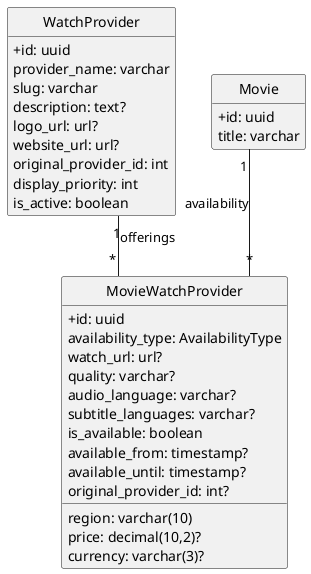

# Availability & Providers

Watch providers and availability options for movies.

```plantuml
@startuml Availability
hide circle
hide empty members
skinparam classAttributeIconSize 0
skinparam linetype ortho

class WatchProvider {
  +id: uuid
  provider_name: varchar
  slug: varchar
  description: text?
  logo_url: url?
  website_url: url?
  original_provider_id: int
  display_priority: int
  is_active: boolean
}

class MovieWatchProvider {
  +id: uuid
  availability_type: AvailabilityType
  region: varchar(10)
  price: decimal(10,2)?
  currency: varchar(3)?
  watch_url: url?
  quality: varchar?
  audio_language: varchar?
  subtitle_languages: varchar?
  is_available: boolean
  available_from: timestamp?
  available_until: timestamp?
  original_provider_id: int?
}

class Movie {
  +id: uuid
  title: varchar
}

WatchProvider "1" -- "*" MovieWatchProvider : offerings
Movie "1" -- "*" MovieWatchProvider : availability

@enduml
```
