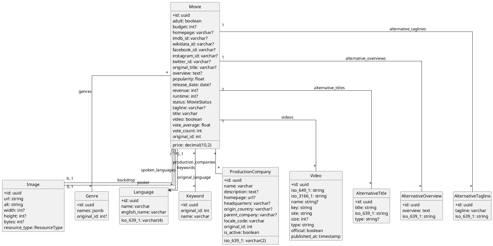

# Catalog

The Catalog domain includes movies and their descriptive data: genres, languages, keywords, images, videos, and production companies.

```plantuml
@startuml Catalog
hide circle
hide empty members
skinparam classAttributeIconSize 0
skinparam linetype ortho

' Core
class Movie {
  +id: uuid
  adult: boolean
  budget: int?
  homepage: varchar?
  imdb_id: varchar?
  wikidata_id: varchar?
  facebook_id: varchar?
  instagram_id: varchar?
  twitter_id: varchar?
  original_title: varchar?
  overview: text?
  popularity: float
  release_date: date?
  revenue: int?
  runtime: int?
  status: MovieStatus
  tagline: varchar?
  title: varchar
  video: boolean
  vote_average: float
  vote_count: int
  price: decimal(10,2)
  original_id: int
}

class Image {
  +id: uuid
  url: string
  alt: string
  width: int?
  height: int?
  bytes: int?
  resource_type: ResourceType
}

class Genre {
  +id: uuid
  names: jsonb
  original_id: int?
}

class Language {
  +id: uuid
  name: varchar
  english_name: varchar
  iso_639_1: varchar(4)
}

class Keyword {
  +id: uuid
  original_id: int
  name: varchar
}

class ProductionCompany {
  +id: uuid
  name: varchar
  description: text?
  homepage: url?
  headquarters: varchar?
  origin_country: varchar?
  parent_company: varchar?
  locale_code: varchar
  iso_639_1: varchar(2)
  original_id: int
  is_active: boolean
}

class Video {
  +id: uuid
  iso_649_1: string
  iso_3166_1: string
  name: string?
  key: string
  site: string
  size: int?
  type: string
  official: boolean
  published_at: timestamp
}

class AlternativeTitle {
  +id: uuid
  title: string
  iso_639_1: string
  type: string?
}

class AlternativeOverview {
  +id: uuid
  overview: text
  iso_639_1: string
}

class AlternativeTagline {
  +id: uuid
  tagline: varchar
  iso_639_1: string
}

' Relationships
Movie "1" o-- "0..1" Image : backdrop
Movie "1" o-- "0..1" Image : poster
Movie "1" -- "*" Video : videos
Movie "1" -- "*" AlternativeTitle : alternative_titles
Movie "1" -- "*" AlternativeOverview : alternative_overviews
Movie "1" -- "*" AlternativeTagline : alternative_taglines
Movie "*" -- "*" Genre : genres
Movie "*" -- "*" ProductionCompany : production_companies
Movie "*" -- "*" Language : spoken_languages
Movie "0..1" --> Language : original_language
Movie "*" -- "*" Keyword : keywords

@enduml
```
