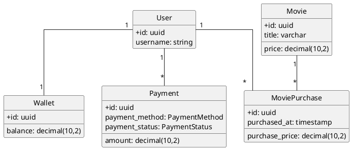

# Commerce & Payments

Purchases, payments, and wallets.

```plantuml
@startuml Commerce
hide circle
hide empty members
skinparam classAttributeIconSize 0
skinparam linetype ortho

class User {
  +id: uuid
  username: string
}

class Wallet {
  +id: uuid
  balance: decimal(10,2)
}

class Payment {
  +id: uuid
  amount: decimal(10,2)
  payment_method: PaymentMethod
  payment_status: PaymentStatus
}

class MoviePurchase {
  +id: uuid
  purchase_price: decimal(10,2)
  purchased_at: timestamp
}

class Movie {
  +id: uuid
  title: varchar
  price: decimal(10,2)
}

User "1" -- "1" Wallet
User "1" -- "*" Payment

User "1" -- "*" MoviePurchase
Movie "1" -- "*" MoviePurchase

@enduml
```
