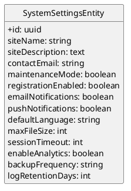

# System

System-wide configuration.

```plantuml
@startuml System
hide circle
hide empty members
skinparam classAttributeIconSize 0
skinparam linetype ortho

class SystemSettingsEntity {
  +id: uuid
  siteName: string
  siteDescription: text
  contactEmail: string
  maintenanceMode: boolean
  registrationEnabled: boolean
  emailNotifications: boolean
  pushNotifications: boolean
  defaultLanguage: string
  maxFileSize: int
  sessionTimeout: int
  enableAnalytics: boolean
  backupFrequency: string
  logRetentionDays: int
}

@enduml
```
