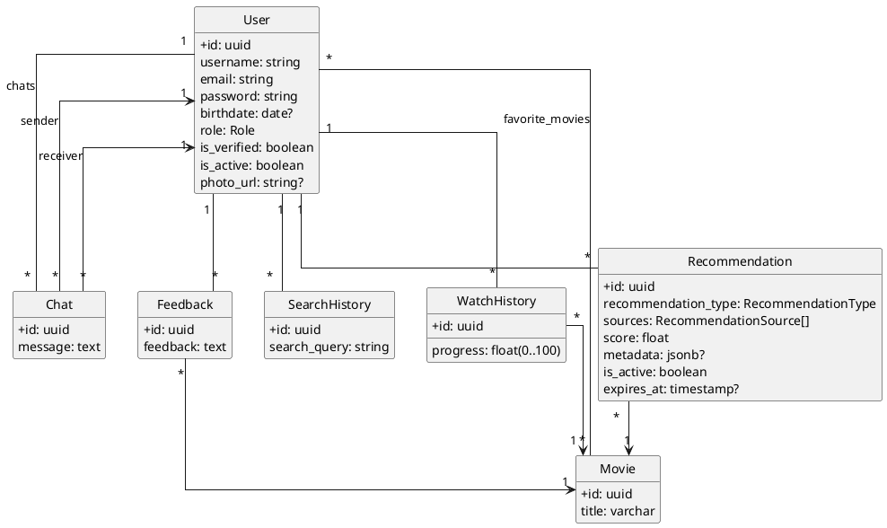

# User & Activity

User accounts and user-driven activity.

```plantuml
@startuml UserAndActivity
hide circle
hide empty members
skinparam classAttributeIconSize 0
skinparam linetype ortho

class User {
  +id: uuid
  username: string
  email: string
  password: string
  birthdate: date?
  role: Role
  is_verified: boolean
  is_active: boolean
  photo_url: string?
}

class Chat {
  +id: uuid
  message: text
}

class Feedback {
  +id: uuid
  feedback: text
}

class SearchHistory {
  +id: uuid
  search_query: string
}

class WatchHistory {
  +id: uuid
  progress: float(0..100)
}

class Recommendation {
  +id: uuid
  recommendation_type: RecommendationType
  sources: RecommendationSource[]
  score: float
  metadata: jsonb?
  is_active: boolean
  expires_at: timestamp?
}

class Movie {
  +id: uuid
  title: varchar
}

' Relations
User "1" -- "*" Chat : chats
Chat "*" --> "1" User : sender
Chat "*" --> "1" User : receiver

User "1" -- "*" Feedback
Feedback "*" --> "1" Movie

User "1" -- "*" SearchHistory
User "1" -- "*" WatchHistory
WatchHistory "*" --> "1" Movie

User "1" -- "*" Recommendation
Recommendation "*" --> "1" Movie

' Favorites
User "*" -- "*" Movie : favorite_movies

@enduml
```
