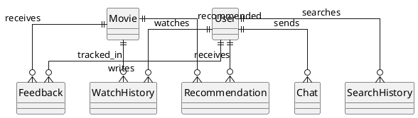

# Activity ERD (PlantUML)

```plantuml
@startuml
hide circle
skinparam linetype ortho

entity User
entity Movie
entity Feedback
entity WatchHistory
entity SearchHistory
entity Chat
entity Recommendation

User ||--o{ Feedback : writes
User ||--o{ WatchHistory : watches
User ||--o{ SearchHistory : searches
User ||--o{ Chat : sends
User ||--o{ Recommendation : receives

Movie ||--o{ Feedback : receives
Movie ||--o{ WatchHistory : tracked_in
Movie ||--o{ Recommendation : recommended

@enduml
```
