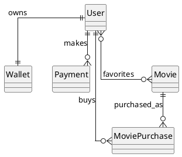

# Commerce ERD (PlantUML)

```plantuml
@startuml
hide circle
skinparam linetype ortho

entity User
entity Wallet
entity Payment
entity MoviePurchase
entity Movie

User ||--|| Wallet : owns
User ||--o{ Payment : makes
User ||--o{ MoviePurchase : buys
User }o--o{ Movie : favorites

Movie ||--o{ MoviePurchase : purchased_as

@enduml
```
