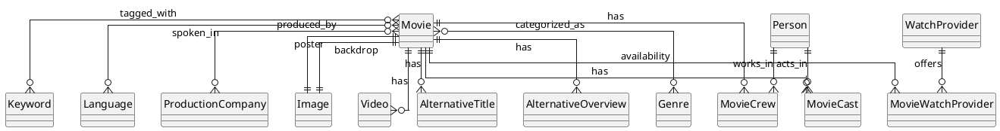

# Content ERD (PlantUML)

```plantuml
@startuml
hide circle
skinparam linetype ortho

entity Movie
entity Genre
entity Keyword
entity Language
entity ProductionCompany
entity Person
entity Image
entity Video
entity AlternativeTitle
entity AlternativeOverview
entity MovieCast
entity MovieCrew
entity WatchProvider
entity MovieWatchProvider

Movie ||--o{ Video : has
Movie ||--|| Image : poster
Movie ||--|| Image : backdrop
Movie }o--o{ Genre : categorized_as
Movie }o--o{ Keyword : tagged_with
Movie }o--o{ Language : spoken_in
Movie }o--o{ ProductionCompany : produced_by
Movie ||--o{ AlternativeTitle : has
Movie ||--o{ AlternativeOverview : has
Movie ||--o{ MovieCast : has
Movie ||--o{ MovieCrew : has

Person ||--o{ MovieCast : acts_in
Person ||--o{ MovieCrew : works_in

Movie ||--o{ MovieWatchProvider : availability
WatchProvider ||--o{ MovieWatchProvider : offers

@enduml
```
